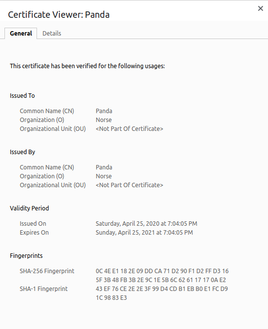
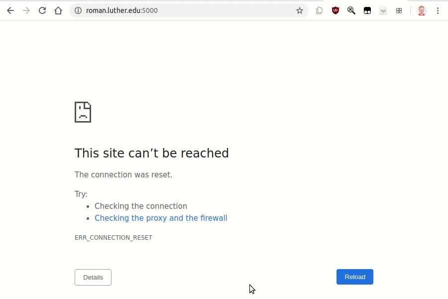

# Use OAuth for user Authorization

The purpose of this project is for you to work with various tools (`openssl`, `flask` etc) to enable access to your web application over HTTPS and user authorization using OAuth. Follow the tutorials and make the necessary changes to your application as you copy/paste commands and code snippets.

## Seize Domain Name

You must control a domain name for the certificate (and the OAuth) to make sense and work properly. The easiest way to commandeer a domain is to edit `/etc/hosts` file on Ubuntu or `c:\Windows\System32\drivers\etc\` on Windows. Adding the following line to that file will redirect any requests for *roman.luther.edu* to *127.4.6.1* (localhost).

Use your own name and address (anything in the 127/8 subnet is a `localhost`, I chose 4.6.1 because it's almost 460).

```bash
127.4.6.1       roman.luther.edu
```

## Configure TLS on a Local Web server

Estimated time: 0-15 minutes

Follow the tutorial on DigitalOcean and create a self-signed certificate for Apache on Ubuntu 18.04. The resulting certificate should be similar to the *norse-panda* certificate. *Use your own name and location*!

You can skip this step as Grinberg shows the same command.



## Run Flask over HTTPS

Estimated time: 15 minutes

Read Grinberg's tutorial and add the generated key and certificate to your Flask app for it to be accessible over HTTPS.

## Enable and Use OAuth

Estimated time: 60 minutes

Follow the RealPython tutorial to enable OAuth and get access to basic user information.

The result should look as follows:



## (Optional) Get a Real TLS Certificate

Estimated time: 5-500 minutes

Follow the tutorial on Let's Encrypt and the tool they recommend, `Certbot`, to generate a certificate signed by a proper Certificate Authority.

Using Let's Encrypt is optional but highly recommended.

## References

* [How To Create a Self-Signed SSL Cert for Apache in Ubuntu 18.04 | DigitalOcean](https://www.digitalocean.com/community/tutorials/how-to-create-a-self-signed-ssl-certificate-for-apache-in-ubuntu-18-04)
* [Running Your Flask Application Over HTTPS - miguelgrinberg.com](https://blog.miguelgrinberg.com/post/running-your-flask-application-over-https)
* [Create a Flask Application With Google Login – Real Python](https://realpython.com/flask-google-login/)
* [Getting Started - Let's Encrypt - Free SSL/TLS Certificates](https://letsencrypt.org/getting-started/)
* [Certbot](https://certbot.eff.org/)
* [badssl.com](https://badssl.com/)
* [How To Create a SSL Certificate on Apache for Ubuntu 14.04 | DigitalOcean](https://www.digitalocean.com/community/tutorials/how-to-create-a-ssl-certificate-on-apache-for-ubuntu-14-04)
* [Creating Self-Signed SSL Certificates for Apache on Linux - Linux.com](https://www.linux.com/training-tutorials/creating-self-signed-ssl-certificates-apache-linux/)
* [Login to your Flask app with Google - Python Tutorial](https://pythonspot.com/login-to-flask-app-with-google/)
